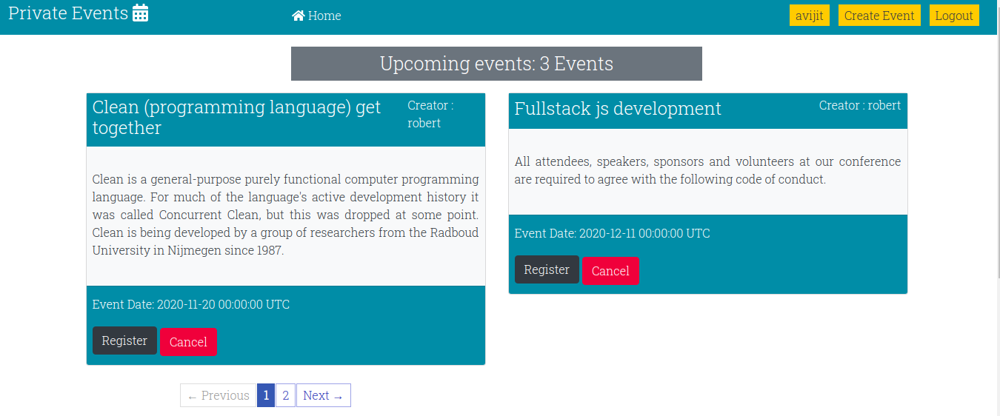
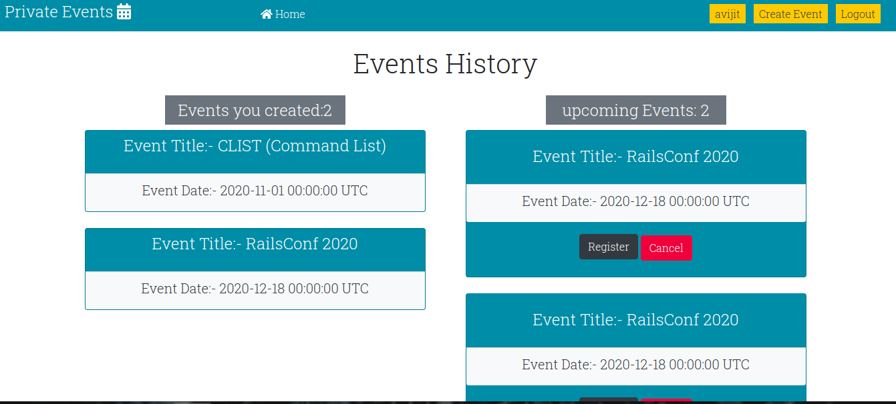
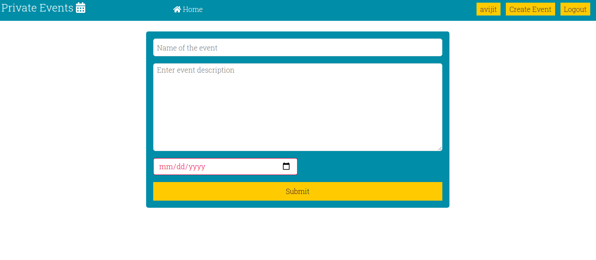

# private Events

> This is a Microverse Ruby on rails project that allows users to create events, attend events, cancel event attendance and see who is attending an event. It also has a login and sign up functionality. Users are normally
restricted from using the app until they sign up and log in.





## Features
In this project I developed a simple event app with authentication:

- The form uses Bootstrap library for css combined with embedded ruby code
- The back end is set up with User,Event and Attendance models that validates presence of username,password,event title,event description. These models also contains different associations between each other.
- I manually created different controller and session functions to perform user's authentication and corresponding actions such as Log in, Log out,Sign up.
- If user check the page without being authenticated, he/she will not be able to see the events and the timestamps from the events. Once user do the login then he/she can use all the functionalities of the app.
- Any user who signed up and logged in can create their own events.
- Any user who signed up and logged in can create attend displayed upcoming events.
- Event show page displays event description with it's title, date and names of the people attending the event.
- User can see his or her own profile and can check events history (number of events user created or number of events user attended or going to attend)
- Pagination is used for visual appeal.

## Built With

- Ruby on Rails
- Ruby
- Rubocop
- Atom text editor
- fontawesome
- Bootstrap
- Will paginate gem
- Rspec gem
- Capybara gem

# Getting Started

To get a local copy of the repository please run the following commands on your terminal:

```
$ cd <folder>
```

```bash
$ git clone `https://github.com/ajkacca457/private-events.git`
$ cd private-events
$ bundle install
$ yarn install --check-files if yarn is not updated
$ Run `rails db:migrate` to create necessary tables in database
$ Run `rails server` to see the user interface.
$ Open your browser and go to http://localhost:3000/
```

# Authors

👤 **Avijit Karmaker**

- Github: [@Avijit](https://github.com/ajkacca457)
- Linkedin:[@Avijit](https://www.linkedin.com/in/avijit-karmaker-8738a54)

## 🤝 Contributing

Contributions, issues and feature requests are welcome!

## Show your support

Give a ⭐️ if you like this project!

## Copyright
This is a project developed by Microverse Student as the part of skill curriculum.
